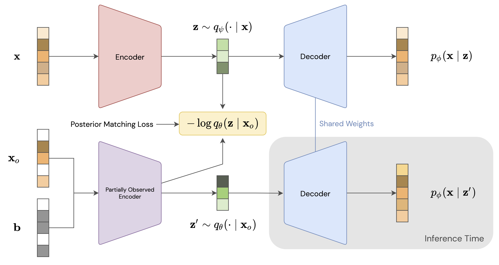

[1]: https://arxiv.org/abs/2201.12414

# Posterior Matching for Arbitrary Conditioning

This is the official repository for the paper
[Posterior Matching for Arbitrary Conditioning][1]. It contains code that
can be used to reproduce most of the experiments from the paper.

All of our models and experiments are implemented in
[Jax](https://github.com/google/jax).

In the paper, we present a method, called Posterior Matching, that allows
Variational Autoencoders to do arbitrary conditional density estimation, without
requiring any changes to the base VAE model. This technique can even be applied to
pretrained VAEs.



## Installation

This code was developed and tested with Python 3.9. Nearby versions of Python will
probably work fine as well. Python 2 definitely won't work.

The [`requirements.txt`](requirements.txt) file lists all of the Python dependencies
needed to use this code. Note that you will likely want to install Jax first and on its
own, following [this guide](https://github.com/google/jax#installation), so that you can
make sure to install the appropriate version based on whether you are using GPUs or
TPUs and your version of CUDA. Also note that most of the package versions in
[`requirements.txt`](requirements.txt) do not actually need to strictly be what is
listed. Those are simply the versions that were in use when this repository was created.
If you are having version conflicts, you will most likely be safe to deviate from the
listed versions as needed (no guarantees though!).

Also, if you are using GPUs, you will need to make sure you have the correct CUDA
drivers and libraries installed so that Jax can actually use the GPUs.

### UCI Datasets

The [`datasets`](datasets) directory contains code for building the 5 UCI datasets from
the paper as TensorFlow Datasets. The datasets will need to be built before they can
be used inside the code. To build, for example, the Gas dataset, you can run:
```
cd datasets/gas
tfds build
```

Note that `gdown` must be installed (via pip) in order to download the data and build
the datasets.

## Organization

The [`posterior_matching`](posterior_matching) package contains all of the supporting
code for the main Python scripts. This is where all of the
[models](posterior_matching/models) are defined, along with some other utilities. In the
root directory, `train_*.py` files are for training models and `eval_*.py` files are
for evaluating trained models. Additionally, the [`notebooks`](notebooks) directory
contains a few Jupyter notebooks for doing certain evaluations and creating some plots
similar to the ones in the paper. Finally, the [`configs`](configs) directory contains
config files for various models -- these files are passed as options to the training
scripts.

## Usage

Below, we outline the basic steps needed to train and evaluate the models described in
the paper. Note that in general, the training scripts will always create a directory to
store data from the training run. TensorBoard logs will be saved in these directories as
well, allowing for training monitoring. Also, when running evaluation scripts, relevant
results will be saved in the directory for the model being evaluated.

### Vanilla VAE with Posterior Matching

The `train_pm_vae.py` will train a pretty simple VAE model with Posterior Matching.
The VAE and the partially observed posterior are trained jointly (although the model
can be configured to stop gradients on the posterior samples in the Posterior Matching
loss so that the VAE and the partially observed posterior are updated independently).

See example config files and the
[`PosteriorMatchingVAE`](posterior_matching/models/vae.py) class for details on how the
model can be used and configured.

#### UCI Datasets

This is the type of model that was used for the UCI datasets. To replicate the UCI
experiments:
1. Run the following command to train the model (substituting the config file for your
   dataset of choice as necessary):
   ```
   python train_pm_vae.py --config configs/pm_vae_gas.py
   ```
2. Run the evaluation with:
   ```
   python eval_pm_vae_uci.py --run_dir runs/pm-vae-gas-20220305-172651 --dataset gas
   ```
   but replace the path `runs/pm-vae-gas-20220305-172651` with the directory that was
   created by the training script.

#### MNIST

The `train_pm_vae.py` script can be used to produce a UMAP plot for MNIST, similar to
Figure 3 in the paper. The necessary steps are:
1. Train the model with:
   ```
   python train_pm_vae.py --config configs/pm_vae_mnist.py
   ```
2. Run the [`mnist_plots.ipynb`](notebooks/mnist_plots.ipynb) notebook, inside
which you should set the `RUN_DIR` variable to the directory that was just created
by the training script.

### Vector Quantized VAE

The experiments with [VQ-VAE](https://arxiv.org/abs/1711.00937) for image inpainting
can be reproduced as follows.

1. First we train the plain VQ-VAE model, with e.g.:
   ```
   python train_vqvae.py --config configs/vqvae_mnist.py
   ```
2. Then, we train a partially observed posterior for that VQ-VAE with:
   ```
   python train_pm_vqvae.py --config configs/pm_vqvae_mnist.py
   ```
   **Before running this command, you need to set `config.vqvae_dir` in the config file
   to the run directory created by the `train_vqvae.py` script.**
3. Finally, you can evaluate the model in terms of PSNR and Precision/Recall by running:
   ```
   python eval_pm_vqvae.py \
       --run_dir runs/pm-vqvae-mnist-20220305-181341 \
       --dataset mnist \
       --mask_generator MNISTMaskGenerator
   ```
   but replace the path `runs/pm-vqvae-mnist-20220305-181341` with the directory that
   was created by the `train_pm_vqvae.py` script.

### Hierarchical VAE

The experiments with [VDVAE](https://arxiv.org/abs/2011.10650) for image inpainting
can be reproduced as follows. Note that these models are very compute intensive and
are best trained on as many accelerators as possible. The MNIST model in the paper
trained for roughly 3 days on 8 TPUv3 cores. _Also note that the batch size in the
config files refers to the per-device batch size, so this number may need to be adjusted
depending on the number of accelerators you are using._

1. Train the VDVAE model with:
   ```
   python train_pm_vdvae.py --config configs/pm_vdvae_mnist.py
   ```
2. You can evaluate the model in terms of PSNR and Precision/Recall by running:
   ```
   python eval_pm_vdvae_imputation.py \
       --run_dir runs/pm-vdvae-mnist-20220305-121126 \
       --dataset mnist \
       --mask_generator MNISTMaskGenerator
   ```
   but replace the path `runs/pm-vdvae-mnist-20220305-121126` with the directory that
   was created by the `train_pm_vdvae.py` script.
3. You can evaluate the model in terms of likelihoods by running:
   ```
   python eval_pm_vdvae_likelihood.py \
       --run_dir runs/pm-vdvae-mnist-20220305-121126 \
       --dataset mnist \
       --mask_generator MNISTMaskGenerator \
       --batch_size 625
   ```
   but replace the path `runs/pm-vdvae-mnist-20220305-121126` with the directory that
   was created by the `train_pm_vdvae.py` script. Note that the default (per-device)
   batch size of 625 was used to most efficiently evaluate the 10000 MNIST test
   instances on the 8 TPUv3 cores. On other hardware, a smaller batch size may be
   required.

### Partially Observed Clustering

The experiments with [VaDE](https://arxiv.org/abs/1611.05148) for partially observed
clustering can be reproduced as follows.

1. First we train the plain VaDE model, with e.g.:
   ```
   python train_vade.py --config configs/vade_mnist.py
   ```
   Note that VaDE is notoriously difficult to train and can be very sensitive to the
   random seed. You may need to run the script several times in order to get a model
   that is on par with the performance in our paper and the original VaDE paper.
2. Next, we train a partially observed posterior for the VaDE model with:
   ```
   python train_pm_vade.py --config configs/pm_vade_mnist.py
   ```
   **Before running this command, you need to set `config.vade_dir` in the config file
   to the run directory created by the `train_vade.py` script.**
3. Finally, you can plot the clustering accuracy as a function of missingness (similar
   to the plots in the paper) by running the
   [`clustering_plots.ipynb`](notebooks/clustering_plots.ipynb) notebook. Inside the
   notebook, you will need to set the `RUN_DIR` variable to the directory that was just
   created by `train_pm_vade.py`.

### Active Feature Acquisition

Here, we describe how to reproduce the "Lookahead Posterior" models for active
feature acquisition, as detailed in the paper. We do this experiment on 16x16 MNIST.

1. First, we train a simple VAE with Posterior Matching:
   ```
   python train_pm_vae.py --config configs/pm_vae_mnist16.py
   ```
2. Next, we learn a lookahead posterior network for the model we just trained:
   ```
   python train_lookahead_posterior.py --config configs/lookahead_mnist16.py
   ```
   **Before running this command, you need to set `config.pm_vae_dir` in the config file
   to the run directory created by the `train_pm_vae.py` script.**
3. Now we collect acquisition trajectories using the trained models:
   ```
   python eval_greedy_acquisition.py \
       --run_dir runs/lookahead-mnist16-20220303-081804 \
       --dataset mnist16
   ```
   Replace the path `runs/lookahead-mnist16-20220303-081804` with the directory that
   was created by the `train_lookahead_posterior.py` script.
4. Finally, plots similar to the ones found in the paper can be created with the
   [`greedy_acquisition_plots.ipynb`](notebooks/greedy_acquisition_plots.ipynb)
   notebook. Inside the notebook, you will need to set the `RUN_DIR` variable to the
   directory that was created by `train_lookahead_posterior.py`.
